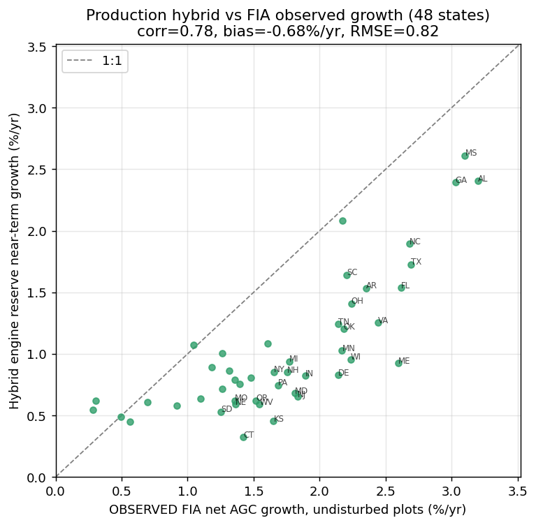

# Validation: production hybrid engine vs FIA observed growth

Independent, read-only check of the FIA-anchored **hybrid** engine
(`yc_hybrid_v1`, the production default per ADR 0001) against the FIA
**remeasurement record** — the one ground truth the ADR did not test
(it validated CV fit and t0 anchoring, not the *projected change*).

## Method
For each of the 48 CONUS states, the **observed** net annual above-ground
live-carbon growth rate on **undisturbed** plots is
`mean[(AGC_t2 − AGC_t1)/REMPER] / mean[AGC_t1]` over paired FIA remeasurement
plots whose latest-visit treatment is "untreated" (the empirical analogue of
the engine's `reserve (no harvest)` scenario). This is compared to the
hybrid's reserve trajectory near-term (2022→2032) growth rate.
Script: `scripts/yield_curve_engine/ycx_validate_obs.R`.

## Result
- **Spatial correlation r = 0.78** across 48 states — the engine reproduces
  the geography of forest productivity well (fast southern pine AL/MS/GA/NC/TX
  high in both; slow western CO/AZ/NV low in both).
- **Conservative bias −0.68 %/yr** (engine 1.01 %/yr vs observed 1.68 %/yr;
  RMSE 0.82). Every state plots below the 1:1 line.

## Interpretation
The low bias is expected and largely by design:
1. The hybrid's **senescence decline tail** engages for mature stands, lowering
   the aggregate near-term growth of the current (age-mixed) inventory.
2. Age-based yield curves carry **no ingrowth/recruitment** — new trees crossing
   the measurement threshold add observed growth the curve cannot.
3. The per-state FIA-anchoring scalar (median 0.86) compresses standing stock,
   which also trims the slope.

**Takeaway:** the hybrid is spatially well-calibrated and conservative on
near-term magnitude — appropriate for a tool whose purpose is to *bound*
long-horizon accumulation. A future refinement could add an ingrowth term or
relax the early-age decline so near-term growth tracks the observed rate while
preserving the long-horizon culmination behaviour.

Per-state numbers: `results/hybrid_validation_vs_obs.csv`.
