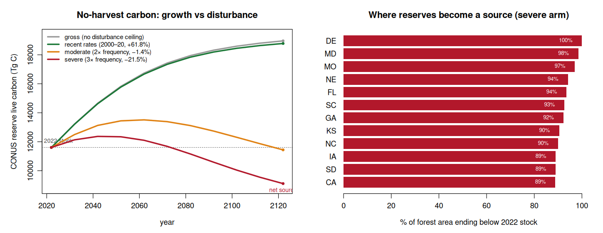

# Reserve-with-disturbance decline scenario

Read-only analysis (Cardinal jobs 11211233, 11211619). Shows that a no-harvest
"reserve" is not an unconditional carbon sink: under climate-elevated natural
disturbance the CONUS no-management trajectory plateaus and then becomes a net
carbon **source**. Companion to ADR 0002 (which fixes the growth kernel); this
adds the loss side.

## Why this is needed

The recalibrated reserve trajectory in ADR 0002 carries the *average* 2000–2020
disturbance already (it is fit to untreated remeasurement plots, ~10% of which
were disturbed). It cannot show the *downside*: what happens if fire, insects,
and wind run hotter than the recent mean, as every regional climate projection
implies. So we decompose growth into a clean undisturbed kernel minus an
explicit, dial-able disturbance drag.

## Method

From FIA `COND.DSTRBCD1` on 272,356 untreated remeasurement plots:
- 10.0% disturbed over the interval → annual disturbance probability **0.0146/yr**
  (≈ 1-in-68-yr average return), fire the leading agent (34% of events), then
  animal (26%), weather (19%).
- Net increment splits **1.114** (undisturbed) vs **0.683** Mg C/ha/yr
  (disturbed); the all-plot kernel (1.070) sits only 3.9% below undisturbed, so
  at *recent* rates disturbance is a minor drag on the live-carbon stock.

Projection (`ycx_disturb_scenario.R`) over the TreeMap-2022 inventory:
`net increment = g_undist(age) − p_dist(stratum) · MULT · sev · density`, with
g_undist the cell-level undisturbed kernel (517 cell / 27 ft / 44 state models),
`p_dist` per ecoregion × forest-type, and `sev` a type-share-weighted live-mortality
fraction per event (fire 0.55, insect 0.35, disease 0.20, weather 0.15, animal
0.03, other 0.10). `MULT` is the climate frequency multiplier.

## Result — CONUS reserve live carbon (Tg C)

| arm | t0 | t100 | 100-yr change |
|---|---:|---:|---:|
| gross (no disturbance ceiling) | 11,607 | 18,961 | +63.4% |
| recent rates (MULT 1, observed severity) | 11,607 | 18,781 | +61.8% |
| moderate (MULT 2, type severity) | 11,607 | 11,439 | **−1.4%** |
| severe (MULT 3, type severity) | 11,607 | 9,112 | **−21.5%** |

The growth ceiling and the recent-rate arm rise to ~+62%. Double the disturbance
frequency and the reserve peaks near 2050, then erodes back to roughly its 2022
stock by 2122 (flat). Triple it and the reserve becomes a net source, shedding a
fifth of its standing carbon; under that arm **34,201 of 59,136** CONUS
forest-strata pixels end below their 2022 stock. The states with the most
net-loss area are high-stock Eastern/Southern forests (DE, MD, MO, FL, SC, GA,
NC) and high-fire California — the loss scales with carbon-at-risk × frequency,
so it is largest where there is the most live carbon to lose.

## Reading and caveats

- At *observed* 2000–2020 rates, elevated disturbance is **not** yet a major CONUS
  drag — the recent arm tracks the growth ceiling. The decline is a forward-looking
  climate-stress scenario, not a description of today.
- `MULT` 2×/3× are illustrative brackets, not tied to a specific RCP; the per-event
  `sev` is a literature-anchored live-mortality fraction, deliberately heavier than
  the mild FIA net-increment signal because killed live carbon leaves the live pool
  even when the plot is not stand-replaced.
- The geographic net-loss pattern is density-weighted, so it highlights where the
  most carbon is exposed rather than only where disturbance is most frequent.
- A mechanistic alternative is available on Cardinal (`conus_mort`: a fitted
  per-species gompit mortality model, AUC 0.74, that makes crowded unmanaged stands
  decline endogenously). A future arm can swap the exogenous hazard for that
  density-dependent mortality.

## Proposed dashboard use

Add a fourth reserve sub-scenario, "reserve (no harvest, disturbance-exposed),"
carrying the moderate arm as the central line and recent/severe as the band, so
the explorer can show that passive carbon storage is conditional on disturbance
staying near historical rates. Implementation is gated on sign-off with the ADR-0002
recalibration (both change published totals).

Artifacts: `scripts/yield_curve_engine/ycx_disturbance_quantify.R`,
`ycx_disturb_scenario.R`; `docs/results/conus_disturb_arms_100yr.csv`,
`disturb_state_netneg.csv`, `disturb_by_type.csv`, `disturb_decline.png`.
